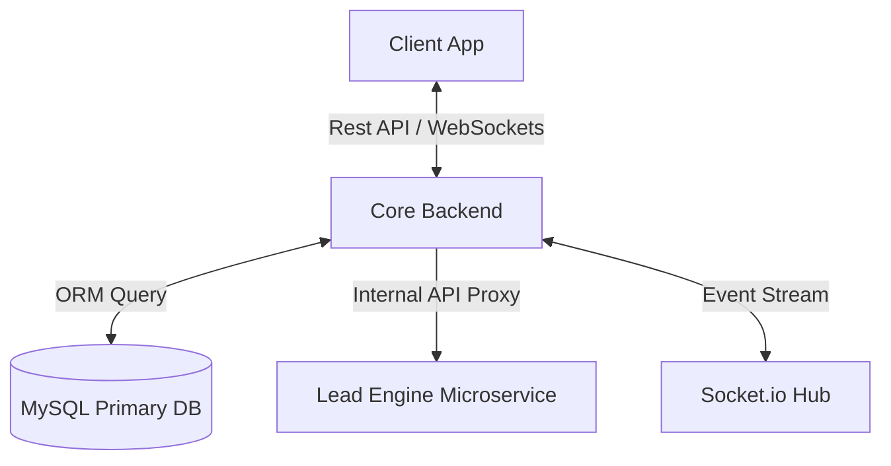

# 
⚙️ TargetUp - Core Backend Infrastructure

  
  
  
  
  

---

## 💎 Overview
The robust, secure, and scalable central nervous system of the **TargetUp Ecosystem**. This backend orchestrates workforce management, real-time communications, and intelligent lead processing by interfacing with specialized microservices.

### ⚡ Technical Capabilities
- **Unified Auth**: JWT-based secure session management with role-based access control (RBAC).
- **Real-time Pipeline**: Bi-directional communication powered by Socket.io for live heartbeats and status updates.
- **Relational Integrity**: High-performance MySQL orchestration via Sequelize ORM.
- **Microservices Orchestration**: Acts as the primary proxy for the Lead Generation Engine.
- **Security First**: Implementation of Helmet, CORS protection, and encrypted payload handling.

---

## 🏗️ Technical Stack (A to Z)

| Layer | Technology | Purpose |
| :--- | :--- | :--- |
| **Runtime** | `Node.js` | Core server execution environment. |
| **Framework** | `Express.js` | Modular API routing and middleware management. |
| **Database ORM** | `Sequelize` | Advanced data modeling and MySQL querying. |
| **Security (Headers)** | `Helmet` | Hardening Express apps by setting various HTTP headers. |
| **Security (Auth)** | `jsonwebtoken` | Stateless digital token authentication. |
| **Encryption** | `bcryptjs` | Optimized password hashing algorithms. |
| **Real-time Engine** | `Socket.io` | Event-driven architecture for live presence. |
| **DB Dialect** | `mysql2` | Efficient MySQL connection pool management. |
| **Process Control** | `Nodemon` | Hot-reloading development lifecycle. |

---

## 🏗️ System Architecture

---

## 📡 Core Global API Specification

### 👥 Personnel & RBAC
- `POST /api/auth/login`: Secured credential validation.
- `GET /api/employees`: Unified personnel directory access.
- `GET /api/admin/roles`: Dynamic permission and privilege control.

### 💼 Lead Logistics
- `POST /api/leads/extract`: Orchestration command sent to Lead Engine.
- `GET /api/leads/job/:id`: Status monitoring proxy for async extraction.
- `GET /api/categories`: Access to the multi-level lead taxonomy system.

### 📊 Attendance & Ops
- `POST /api/attendance/check-in`: Real-time workforce entry logic.
- `GET /api/attendance/stats/today`: Live operational dashboard statistics.

---

*The Core Hub of the TargetUp Intelligent Ecosystem*

